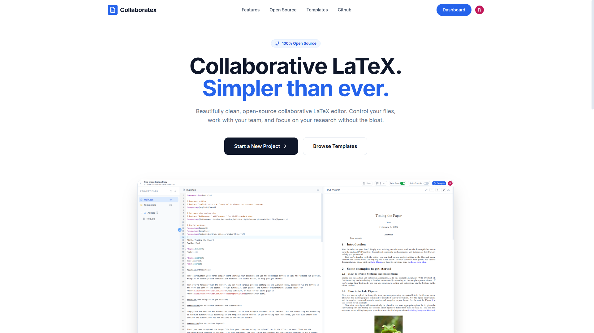
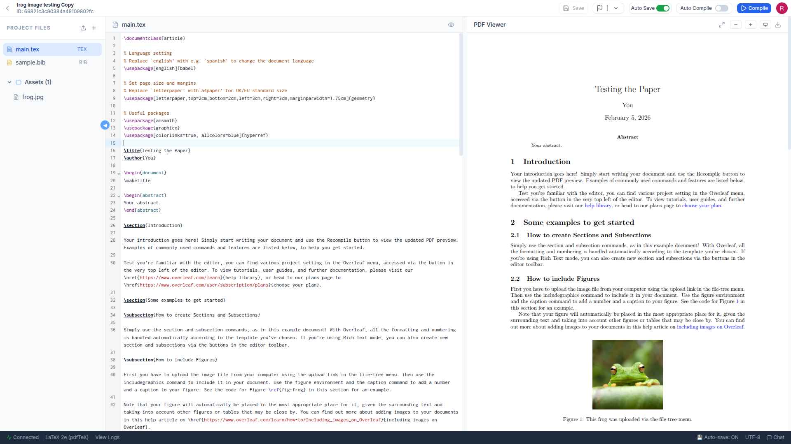

# collaboratex
        
      collaboratex is a web-based editor 

homepage
 

editor
 

dashboard
 

##  Architecture Overview
Roughly this is what it looks like.

```
Client (React + Apollo)
   │
   ├── Queries / Mutations
   ├── Subscriptions (WebSocket)
   │
Server (GraphQL API)
   │
   ├── Auth Middleware
   ├── Resolvers
   ├── CRDT Merge Layer
Containers (latex compiler image)
   │
   ├── Latex project compilation
   │
Database
```

To learn more about the Architecture and design, check out:
[link](https://razzat008.github.io/collaboratex) 
