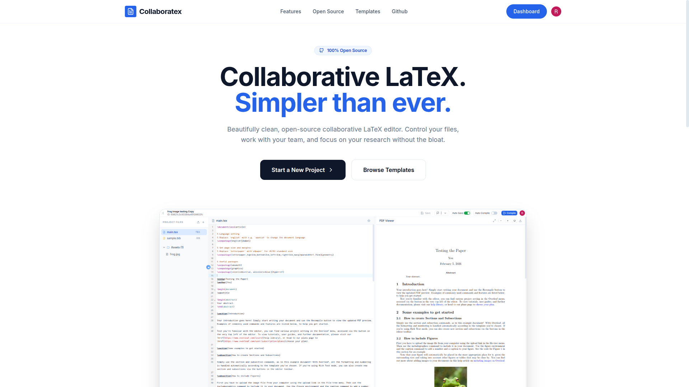
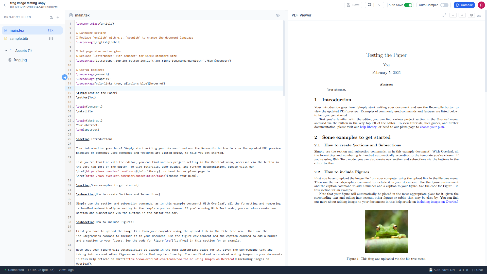
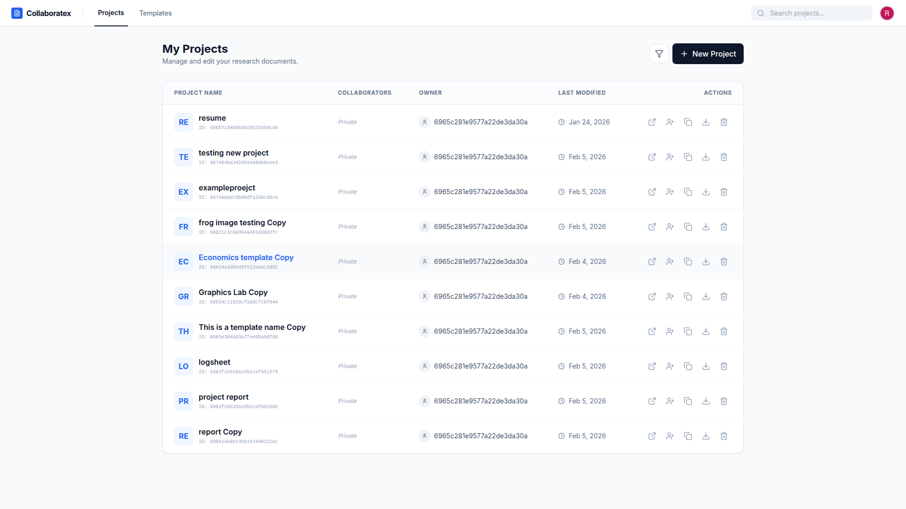

# collaboratex
        
      collaboratex is a web-based editor 


## Documentation

To learn more about the Architecture and design, check out:
[link](https://razzat008.github.io/collaboratex) 

or ask DeepWiki\
[](https://deepwiki.com/razzat008/collaboratex)


### Some screenshots:

- homepage
 

- editor
 

- dashboard
 

##  Architecture Overview
Roughly this is what it looks like.


```
Client (React + Apollo)
   │
   ├── Queries / Mutations
   ├── Subscriptions (WebSocket)
   │
Server (GraphQL API)
   │
   ├── Auth Middleware
   ├── Resolvers
   ├── CRDT Merge Layer
Containers (latex compiler image)
   │
   ├── Latex project compilation
   │
Database
```
--- 

Feel free to contact us about the project:

- **Manogya Dahal**: [manogyadahal@gmail.com](mailto:manogyadahal@gmail.com)
- **Rajat Dahal**: [contact@rajatdahal.com.np](mailto:contact@rajatdahal.com.np)

